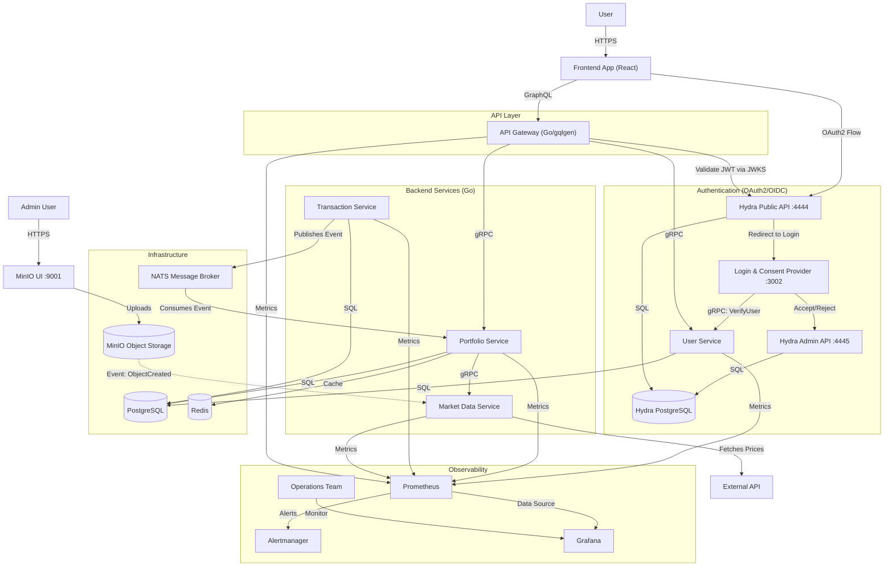
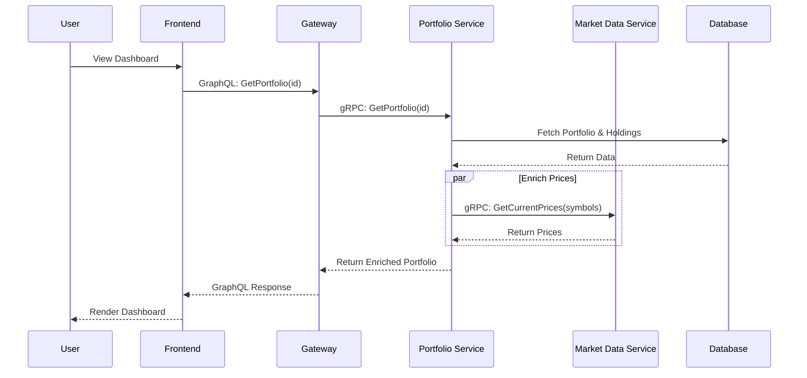
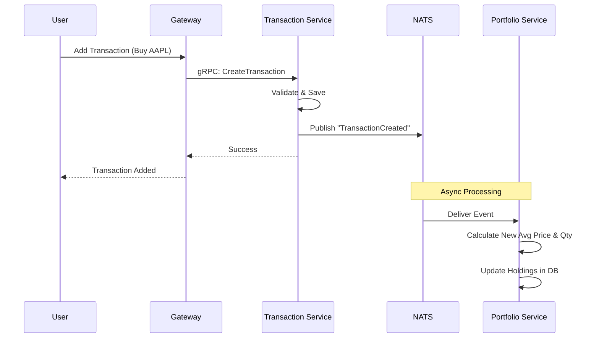
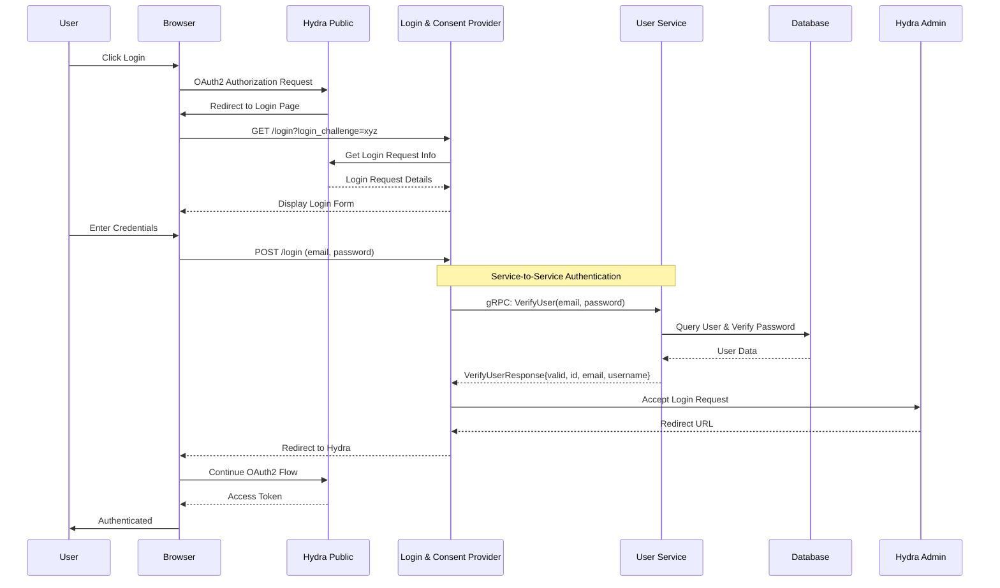

# Portfolio Insights

**Portfolio Insights** is a modern, microservices-based application for tracking stock portfolios. It leverages a clean architecture approach with Go microservices, a GraphQL API Gateway, and a React frontend.

## 🏗️ Architecture Overview

The system follows a microservices architecture pattern, utilizing **gRPC** for synchronous inter-service communication and **NATS** for asynchronous, event-driven workflows.

### System Architecture Diagram



## 🧩 Components

### 1. Authentication Layer

- **Hydra OAuth2/OIDC Server**:
  - **Tech Stack**: Ory Hydra v2.2.0, PostgreSQL.
  - **Responsibility**: Provides OAuth2 and OpenID Connect authentication.
  - **Components**:
    - **Hydra Public API** (`:4444`): Handles OAuth2 flows, token issuance, and JWKS endpoint.
    - **Hydra Admin API** (`:4445`): Internal API for managing OAuth2 clients, accepting login/consent requests.
  - **Features**:
    - JWT-based access tokens.
    - Configurable token TTLs (15m access, 720h refresh).
    - CORS support for frontend integration.

- **Login & Consent Provider**:
  - **Tech Stack**: Go, gRPC Client, HTML.
  - **Responsibility**: Provides the login and consent UI for the OAuth2 flow.
  - **Features**:
    - User authentication via gRPC calls to User Service (service-to-service architecture).
    - No direct database access - improved security and separation of concerns.
    - Consent management for OAuth2 scopes.
    - Session management with secure cookies.
    - Integration with Hydra Admin API for login/consent acceptance.

### 2. Frontend Layer (`apps/frontend`)
- **Tech Stack**: React, TypeScript, Vite, Apollo Client.
- **Responsibility**: Provides the user interface for portfolio management.
- **Features**:
  - Real-time portfolio summary.
  - Holdings table with currency grouping.
  - Interactive charts (recharts).
  - GraphQL integration for efficient data fetching.

### 3. API Gateway (`apps/gateway`)
- **Tech Stack**: Go, gqlgen.
- **Responsibility**: Acts as the single entry point (BFF) for the frontend.
- **Features**:
  - Exposes a unified GraphQL Schema.
  - Handles Authentication & Authorization via Hydra OAuth2/OIDC (JWT validation).
  - Orchestrates calls to backend microservices via gRPC.
  - CORS configuration for secure frontend access.

### 4. Microservices (`services/`)
All services follow **Clean Architecture** principles (Domain, Usecase, Repository/Adapter layers).

- **User Service**:
  - Manages user identities and profiles.
  - **Tech**: Go, gRPC, PostgreSQL.
  
- **Portfolio Service**:
  - Core domain service. Manages Portfolios and Holdings.
  - Subscribes to transaction events to update holdings automatically.
  - **Tech**: Go, gRPC, PostgreSQL, NATS Subscriber.

- **Transaction Service**:
  - Handles recording of Buy/Sell transactions.
  - Publishes `TransactionCreated` events to NATS.
  - **Tech**: Go, gRPC, PostgreSQL, NATS Publisher.

- **Market Data Service**:
  - Provides stock price information.
  - Fetches prices and currency rates from external APIs (e.g., EODHD).
  - **Tech**: Go, gRPC.

### 5. Infrastructure
- **NATS**: Cloud-native messaging system used for the event bus.
- **PostgreSQL**: Relational database for persistent storage.
- **Redis**: In-memory cache for market data prices (reduces API calls to external providers).
- **MinIO**: Object storage for file uploads.

### 6. Observability
- **Prometheus**: Metrics collection and time-series database. Scrapes metrics from all services.
- **Grafana**: Visualization and dashboarding platform. Provides real-time insights into system health and performance.
- **Alertmanager**: Handles alerts from Prometheus and routes them to appropriate channels (e.g., email, Slack).
- **Metrics Exposed**: All services expose Prometheus metrics on dedicated ports (e.g., `:9096` for user-service, `:9098` for portfolio-service).


## 🔄 Data Flow Examples

### 1. Viewing a Portfolio (Synchronous)
When a user views their dashboard, the Gateway aggregates data from multiple services.



### 2. Processing a Transaction (Event-Driven)
When a user adds a transaction, the system updates holdings asynchronously to decouple the write path.



### 3. User Authentication (OAuth2 with Service-to-Service Verification)
When a user logs in, the Login & Consent Provider verifies credentials via the User Service instead of direct database access.




## 🚀 Getting Started

The project uses a Monorepo structure managed by `go.work` and `podman-compose`.

### Prerequisites
- Go 1.22+
- Node.js 20+
- Podman (or Docker) & Podman Compose

### Running the Stack
To start all services and infrastructure:

```bash
make podman-up
```

This command will:
1. Build all Go microservices.
2. Build the Gateway.
3. Start PostgreSQL, Redis, NATS and MinIO.
4. Run DB migrations.


### Access local database 

```
jdbc:postgresql://127.0.0.1:5432/portfolio
```

### Run Hydra
```bash
make hydra-up
```

### Register a new app client
```bash
 ./scripts/create-oauth-client.sh
```


### Running Frontend Locally
```bash
cd apps/frontend
npm install
npm run dev
```
Access the app at `http://localhost:5173`.

- Register a new user by clicking on `Get Started For Free` button.
- Login with the registered user.


### Running GraphQL Playground
Access the GraphQL Playground at `http://localhost:8080`.

### Access the minio admin page
Access the minio admin page at `http://localhost:9001`.

### Market Data Ingestion
To ingest market data such as asset, asset prices and currency rates, upload the csv files to minio bucket `market-data`.


### Running the Monitoring Stack
To start Prometheus, Grafana, and Alertmanager:

```bash
make monitoring-up
```

Access the monitoring tools:
- **Grafana**: `http://localhost:3001` (admin/admin)
- **Prometheus**: `http://localhost:9081`
- **Alertmanager**: `http://localhost:9093`

## Development Tools

-  [Antigravity](https://antigravity.google/) (IDE)
-  LLMs (Gemini 3.0 Pro, Claude Sonnet 4.5)
-  [Datagrip](https://www.jetbrains.com/datagrip/download/?section=mac)