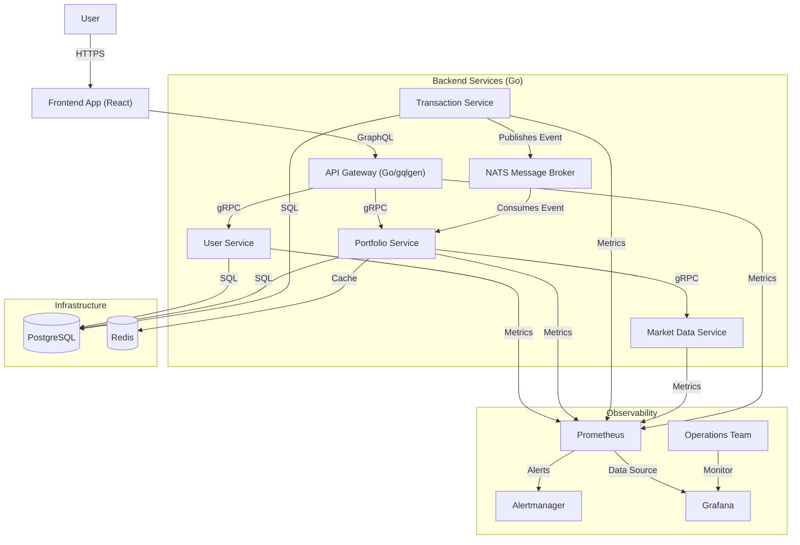
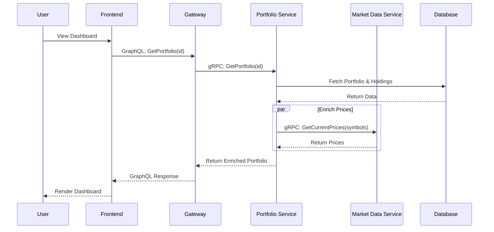
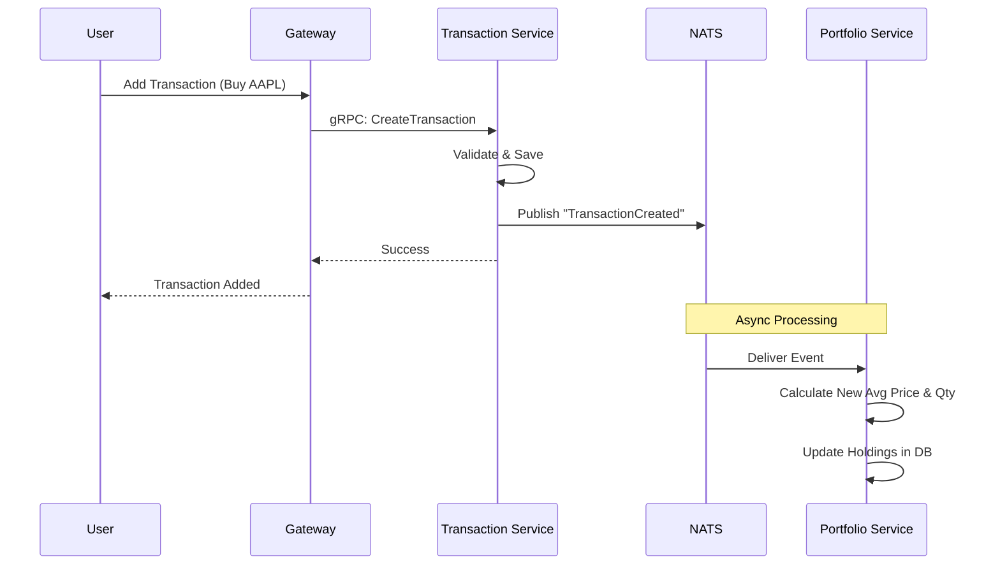

# Portfolio Insights

**Portfolio Insights** is a modern, microservices-based application for tracking stock portfolios. It leverages a clean architecture approach with Go microservices, a GraphQL API Gateway, and a React frontend.

## 🏗️ Architecture Overview

The system follows a microservices architecture pattern, utilizing **gRPC** for synchronous inter-service communication and **NATS** for asynchronous, event-driven workflows.

### System Architecture Diagram



## 🧩 Components

### 1. Frontend Layer (`apps/frontend`)
- **Tech Stack**: React, TypeScript, Vite, Apollo Client.
- **Responsibility**: Provides the user interface for portfolio management.
- **Features**:
  - Real-time portfolio summary.
  - Holdings table with currency grouping.
  - Interactive charts (recharts).
  - GraphQL integration for efficient data fetching.

### 2. API Gateway (`apps/gateway`)
- **Tech Stack**: Go, gqlgen.
- **Responsibility**: Acts as the single entry point (BFF) for the frontend.
- **Features**:
  - Exposes a unified GraphQL Schema.
  - Handles Authentication & Authorization (planned).
  - Orchestrates calls to backend microservices via gRPC.
  - CORS configuration for secure frontend access.

### 3. Microservices (`services/`)
All services follow **Clean Architecture** principles (Domain, Usecase, Repository/Adapter layers).

- **User Service**:
  - Manages user identities and profiles.
  - **Tech**: Go, gRPC, PostgreSQL.
  
- **Portfolio Service**:
  - Core domain service. Manages Portfolios and Holdings.
  - Subscribes to transaction events to update holdings automatically.
  - **Tech**: Go, gRPC, PostgreSQL, NATS Subscriber.

- **Transaction Service**:
  - Handles recording of Buy/Sell transactions.
  - Publishes `TransactionCreated` events to NATS.
  - **Tech**: Go, gRPC, PostgreSQL, NATS Publisher.

- **Market Data Service**:
  - Provides stock price information.
  - **Tech**: Go, gRPC.

### 4. Infrastructure
- **NATS**: Cloud-native messaging system used for the event bus.
- **PostgreSQL**: Relational database for persistent storage.
- **Redis**: In-memory cache for market data prices (reduces API calls to external providers).

### 5. Observability
- **Prometheus**: Metrics collection and time-series database. Scrapes metrics from all services.
- **Grafana**: Visualization and dashboarding platform. Provides real-time insights into system health and performance.
- **Alertmanager**: Handles alerts from Prometheus and routes them to appropriate channels (e.g., email, Slack).
- **Metrics Exposed**: All services expose Prometheus metrics on dedicated ports (e.g., `:9096` for user-service, `:9098` for portfolio-service).


## 🔄 Data Flow Examples

### 1. Viewing a Portfolio (Synchronous)
When a user views their dashboard, the Gateway aggregates data from multiple services.



### 2. Processing a Transaction (Event-Driven)
When a user adds a transaction, the system updates holdings asynchronously to decouple the write path.



## 🚀 Getting Started

The project uses a Monorepo structure managed by `go.work` and `podman-compose`.

### Prerequisites
- Go 1.22+
- Node.js 20+
- Podman (or Docker) & Podman Compose

### Running the Stack
To start all services and infrastructure:

```bash
make podman-up
```

This command will:
1. Build all Go microservices.
2. Build the Gateway.
3. Start PostgreSQL and NATS.
4. Start the Frontend (if containerized) or you can run it locally.

### Running Frontend Locally
```bash
cd apps/frontend
npm install
npm run dev
```
Access the app at `http://localhost:5173`.

### Running GraphQL Playground
Access the GraphQL Playground at `http://localhost:8080`.

### Running the Monitoring Stack
To start Prometheus, Grafana, and Alertmanager:

```bash
cd deployments/monitoring
./start-monitoring.sh
```

Access the monitoring tools:
- **Grafana**: `http://localhost:3001` (admin/admin)
- **Prometheus**: `http://localhost:9090`
- **Alertmanager**: `http://localhost:9093`

