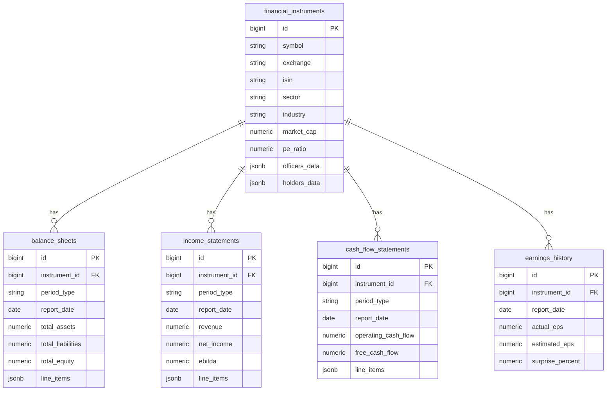

# Database Design: Financial Instrument Fundamentals

## 1. Executive Summary

This document details the schema design for the `financial_instruments` table. This relational database table is designed to store comprehensive fundamental data for financial instruments (stocks, ETFs, etc.), accommodating descriptive metadata, valuation metrics, real-time highlights, and complex nested structures for historical data.

To balance query performance for high-frequency scalar fields (like P/E Ratio, Market Cap) with the flexibility needed for extensive historical arrays (like Financials, Earnings), this design utilizes a **Hybrid Relational-Document** approach. Core 1:1 attributes are flattened into standard SQL columns, while deep, variable-length 1:N datasets are stored in efficient `JSONB` columns.

## 2. Table Definition (DDL)

The following SQL statement uses PostgreSQL syntax, chosen for its robust `JSONB` support and strict typing.

```sql
CREATE TABLE financial_instruments (
    -- Identification (Primary & Logical Keys)
    id BIGSERIAL PRIMARY KEY,
    symbol VARCHAR(20) NOT NULL,
    exchange VARCHAR(20) NOT NULL,
    isin VARCHAR(12),
    cusip VARCHAR(9),
    cik VARCHAR(10),
    open_figi VARCHAR(20),
    
    -- General Metadata
    instrument_type VARCHAR(50),      -- e.g., 'Common Stock'
    name VARCHAR(255) NOT NULL,
    currency_code CHAR(3),            -- e.g., 'USD'
    country_iso CHAR(2),              -- e.g., 'US'
    sector VARCHAR(100),
    industry VARCHAR(100),
    gic_sector VARCHAR(100),
    gic_group VARCHAR(100),
    gic_industry VARCHAR(100),
    gic_sub_industry VARCHAR(100),
    home_category VARCHAR(50),        -- e.g., 'Domestic'
    is_delisted BOOLEAN DEFAULT FALSE,
    description TEXT,
    address TEXT,
    full_time_employees INT,
    ipo_date DATE,
    updated_at TIMESTAMP WITH TIME ZONE,

    -- Key Financial Highlights (Decimal for precision)
    market_cap DECIMAL(24, 4),
    ebitda DECIMAL(24, 4),
    pe_ratio DECIMAL(10, 4),
    peg_ratio DECIMAL(10, 4),
    book_value DECIMAL(10, 4),
    dividend_yield DECIMAL(10, 4),
    eps_basic DECIMAL(10, 4),         -- EarningsShare
    eps_diluted_ttm DECIMAL(10, 4),
    profit_margin DECIMAL(10, 4),
    operating_margin_ttm DECIMAL(10, 4),
    return_on_assets_ttm DECIMAL(10, 4),
    return_on_equity_ttm DECIMAL(10, 4),
    revenue_ttm DECIMAL(24, 4),
    gross_profit_ttm DECIMAL(24, 4),
    target_price DECIMAL(10, 4),      -- WallStreetTargetPrice
    beta DECIMAL(10, 4),
    
    -- Valuation & Statistics
    trailing_pe DECIMAL(10, 4),
    forward_pe DECIMAL(10, 4),
    price_sales_ttm DECIMAL(10, 4),
    price_book_mrq DECIMAL(10, 4),
    enterprise_value DECIMAL(24, 4),
    shares_outstanding BIGINT,
    shares_float BIGINT,
    percent_insiders DECIMAL(10, 4),
    percent_institutions DECIMAL(10, 4),
    
    -- Technical Indicators
    fifty_two_week_high DECIMAL(12, 4),
    fifty_two_week_low DECIMAL(12, 4),
    fifty_day_ma DECIMAL(12, 4),
    two_hundred_day_ma DECIMAL(12, 4),

    -- Complex Data Structures (Stored as JSONB)
    listings_data JSONB,              -- General.Listings
    officers_data JSONB,              -- General.Officers
    holders_data JSONB,               -- Holders (Institutions, Funds)
    insider_transactions_data JSONB,  -- InsiderTransactions
    esg_scores_data JSONB,            -- ESGScores
    outstanding_shares_data JSONB,    -- outstandingShares (annual/quarterly breakdown)

    -- Constraints
    CONSTRAINT uq_symbol_exchange UNIQUE (symbol, exchange),
    CONSTRAINT uq_isin UNIQUE (isin)
);

-- 2.1 Balance Sheets Table
-- Strictly typed columns for key solvency/liquidity metrics.
CREATE TABLE balance_sheets (
    id BIGSERIAL PRIMARY KEY,
    instrument_id BIGINT NOT NULL REFERENCES financial_instruments(id) ON DELETE CASCADE,
    period_type VARCHAR(10) NOT NULL,    -- 'Annual', 'Quarterly'
    report_date DATE NOT NULL,
    filing_date DATE,
    currency_code CHAR(3),
    
    -- Balance Sheet Specific Metrics (Not Nullable if critical)
    total_assets DECIMAL(24, 4),
    total_liabilities DECIMAL(24, 4),
    total_equity DECIMAL(24, 4),
    cash_and_equivalents DECIMAL(24, 4),
    total_debt DECIMAL(24, 4),
    net_debt DECIMAL(24, 4),
    
    line_items JSONB NOT NULL,           -- Full BS Payload
    created_at TIMESTAMP WITH TIME ZONE DEFAULT NOW(),
    CONSTRAINT uq_bs_report UNIQUE (instrument_id, period_type, report_date)
);

-- 2.2 Income Statements Table
-- strictly typed columns for key profitability metrics.
CREATE TABLE income_statements (
    id BIGSERIAL PRIMARY KEY,
    instrument_id BIGINT NOT NULL REFERENCES financial_instruments(id) ON DELETE CASCADE,
    period_type VARCHAR(10) NOT NULL,
    report_date DATE NOT NULL,
    filing_date DATE,
    currency_code CHAR(3),
    
    -- Income Statement Specific Metrics
    revenue DECIMAL(24, 4),
    gross_profit DECIMAL(24, 4),
    operating_income DECIMAL(24, 4),
    net_income DECIMAL(24, 4),
    ebitda DECIMAL(24, 4),
    eps_basic DECIMAL(10, 4),
    eps_diluted DECIMAL(10, 4),
    
    line_items JSONB NOT NULL,           -- Full IS Payload
    created_at TIMESTAMP WITH TIME ZONE DEFAULT NOW(),
    CONSTRAINT uq_is_report UNIQUE (instrument_id, period_type, report_date)
);

-- 2.3 Cash Flow Statements Table
-- Strictly typed columns for key cash generation metrics.
CREATE TABLE cash_flow_statements (
    id BIGSERIAL PRIMARY KEY,
    instrument_id BIGINT NOT NULL REFERENCES financial_instruments(id) ON DELETE CASCADE,
    period_type VARCHAR(10) NOT NULL,
    report_date DATE NOT NULL,
    filing_date DATE,
    currency_code CHAR(3),
    
    -- Cash Flow Specific Metrics
    operating_cash_flow DECIMAL(24, 4),
    investing_cash_flow DECIMAL(24, 4),
    financing_cash_flow DECIMAL(24, 4),
    free_cash_flow DECIMAL(24, 4),
    capital_expenditure DECIMAL(24, 4),
    
    line_items JSONB NOT NULL,           -- Full CF Payload
    created_at TIMESTAMP WITH TIME ZONE DEFAULT NOW(),
    CONSTRAINT uq_cf_report UNIQUE (instrument_id, period_type, report_date)
);

-- 2.4 Earnings History Table (Renumbered)
CREATE TABLE earnings_history (
    id BIGSERIAL PRIMARY KEY,
    instrument_id BIGINT NOT NULL REFERENCES financial_instruments(id) ON DELETE CASCADE,
    report_date DATE NOT NULL,
    actual_eps DECIMAL(10, 4),
    estimated_eps DECIMAL(10, 4),
    surprise_percent DECIMAL(10, 4),
    report_release_date DATE,
    currency_code CHAR(3),
    CONSTRAINT uq_earnings_report UNIQUE (instrument_id, report_date)
);
```

## 3. Column Mapping and Rationale

The following table maps the provided JSON paths to the SQL columns defined above.

| SQL Column Name | JSON Path | SQL Data Type | Justification |
| :--- | :--- | :--- | :--- |
| **id** | N/A | `BIGSERIAL` | Surrogate primary key for efficient internal referencing and FK relationships. |
| **symbol** | `General.Code` | `VARCHAR(20)` | The ticker symbol. 20 chars covers standard tickers and suffixes (e.g., BRK.A). |
| **exchange** | `General.Exchange` | `VARCHAR(20)` | The operating exchange code (e.g., NASDAQ, NYSE). |
| **name** | `General.Name` | `VARCHAR(255)` | Official company name. |
| **isin** | `General.ISIN` | `VARCHAR(12)` | Global standard ID (ISO 6166). Fixed 12 chars. Vital for global uniqueness. |
| **cusip** | `General.CUSIP` | `VARCHAR(9)` | North American standard ID. Fixed 9 chars. |
| **cik** | `General.CIK` | `VARCHAR(10)` | SEC Central Index Key. |
| **instrument_type** | `General.Type` | `VARCHAR(50)` | Categorizes data (Common Stock, ETF, etc.). |
| **sector** | `General.Sector` | `VARCHAR(100)` | High-level categorization. |
| **industry** | `General.Industry` | `VARCHAR(100)` | Granular categorization. |
| **market_cap** | `Highlights.MarketCapitalization` | `DECIMAL(24,4)` | Represents currency. `DECIMAL` prevents floating point errors. Size 24 accommodates trillions. |
| **pe_ratio** | `Highlights.PERatio` | `DECIMAL(10,4)` | Ratio. 4 decimal places provide sufficient precision for analysis. |
| **revenue_ttm** | `Highlights.RevenueTTM` | `DECIMAL(24,4)` | Top-line revenue. Needs high precision/scale. |
| **profit_margin** | `Highlights.ProfitMargin` | `DECIMAL(10,4)` | Percentage value (0.0531 for 5.31%). |
| **shares_outstanding** | `SharesStats.SharesOutstanding` | `BIGINT` | Integer count of shares. Can exceed 2 billion (integer limit), so `BIGINT` is required. |
| **description** | `General.Description` | `TEXT` | Long-form text content. `TEXT` in Postgres is efficient and unlimited length. |
| **officers_data** | `General.Officers` | `JSONB` | Array of objects. 1:N relationship. Stored as JSONB to allow flexible schema (Officers may change roles/fields) and avoid creating a dedicated high-churn table. |
| **holders_data** | `Holders` | `JSONB` | Contains multiple lists (Institutions, Funds). Structure differs between holder types. JSONB handles this polymorphism naturally. |

### 3.2 Separate Table: Balance Sheets

| SQL Column Name | JSON Source | Data Type | Justification |
| :--- | :--- | :--- | :--- |
| **instrument_id** | Foreign Key | `BIGINT` | Links to the parent instrument. |
| **period_type** | Map Key | `VARCHAR` | Identifies 'annual' vs 'quarterly'. |
| **report_date** | Map Key | `DATE` | The specific date key (e.g., "2025-09-30"). |
| **total_assets** | `...totalAssets` | `DECIMAL` | Core solvency metric. |
| **line_items** | Object | `JSONB` | The entire object contents for that date key. |

### 3.3 Separate Table: Income Statements

| SQL Column Name | JSON Source | Data Type | Includes Metrics |
| :--- | :--- | :--- | :--- |
| **revenue** | `...revenue` | `DECIMAL` | Top-line growth. |
| **net_income** | `...netIncome` | `DECIMAL` | Bottom-line profitability. |
| **ebitda** | `...ebitda` | `DECIMAL` | Operational performance. |

### 3.4 Separate Table: Cash Flow Statements

| SQL Column Name | JSON Source | Data Type | Includes Metrics |
| :--- | :--- | :--- | :--- |
| **operating_cash_flow** | `...totalCashFromOperatingActivities` | `DECIMAL` | Core cash generation. |
| **free_cash_flow** | `...freeCashFlow` | `DECIMAL` | Cash available for distribution/reinvestment. |

### 3.5 Earnings History Table

| SQL Column Name | JSON Source | Data Type | Justification |
| :--- | :--- | :--- | :--- |
| **report_date** | Map Key | `DATE` | The fiscal period end date. |
| **actual_eps** | `epsActual` | `DECIMAL` | Core metric. |
| **surprise_percent** | `surprisePercent` | `DECIMAL` | Analytical metric. |

## 4. Indexing Strategy

To ensure high performance for common query patterns (searching by ticker, sorting by market cap, filtering by sector), the following indexes are recommended.

### 4.1. Primary Lookup Indexes
*   **Unique Composite Index**: `CREATE UNIQUE INDEX idx_symbol_exchange ON financial_instruments(symbol, exchange);`
    *   *Rationale*: This is the most distinct way to query a specific stock (e.g., TSLA on NASDAQ).
*   **ISIN Lookup**: `CREATE UNIQUE INDEX idx_isin ON financial_instruments(isin);`
    *   *Rationale*: Essential for mapping data from external data vendors or regulatory feeds which use ISIN as the master key.

### 4.2. Analytical & Filtering Indexes
*   **Sector/Industry**: `CREATE INDEX idx_sector_industry ON financial_instruments(sector, industry);`
    *   *Rationale*: Optimizes queries like "Find all Auto Manufacturers in the Consumer Cyclical sector".
*   **Market Cap**: `CREATE INDEX idx_market_cap ON financial_instruments(market_cap DESC);`
    *   *Rationale*: Frequently used for sorting/ranking (e.g., "Top 10 companies by size").

### 4.3. Full-Text Search (Optional)
*   **Name/Description Search**: `CREATE INDEX idx_gin_description ON financial_instruments USING GIN (to_tsvector('english', name || ' ' || coalesce(description, '')));`
    *   *Rationale*: Allows for fast "Google-like" keyword searching within the company name and description.

### 4.4. JSONB Indexing (Advanced)
*   **Officers Search**: `CREATE INDEX idx_officers_gin ON financial_instruments USING GIN (officers_data);`
    *   *Rationale*: Allows efficient querying of the JSON blob, for example: "Find all companies where Elon Musk is an officer".

## 5. ER Diagram (Mermaid)


