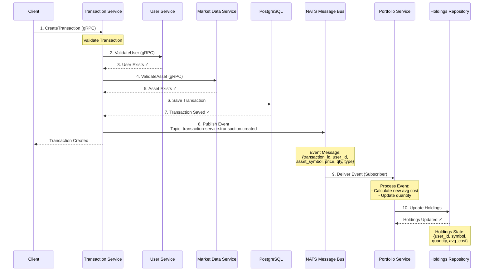

# NATS Event Flow Diagram



## Step-by-Step Flow

1. **Client sends CreateTransaction request** via gRPC to Transaction Service
2. **Transaction Service validates user** by calling User Service via gRPC
3. **User Service responds** with user existence confirmation
4. **Transaction Service validates asset** by calling Market Data Service via gRPC
5. **Market Data Service responds** with asset existence confirmation
6. **Transaction Service saves transaction** to PostgreSQL database
7. **Database confirms** transaction saved successfully
8. **Transaction Service publishes event** to NATS topic `transaction-service.transaction.created`
9. **Portfolio Service receives event** (already subscribed to the topic)
10. **Portfolio Service updates holdings** in its in-memory repository

## Event Message Structure

```json
{
  "transaction_id": "uuid-1234",
  "user_id": "user-5678",
  "asset_symbol": "AAPL",
  "price_per_share": 150.50,
  "quantity": 10.0,
  "type": "BUY",
  "executed_at": "2025-11-22T10:30:00Z"
}
```

## Portfolio Calculation Example

### Initial State
```
User: user-5678
Symbol: AAPL
Quantity: 0
Average Cost: $0
```

### After BUY Event (10 shares @ $150.50)
```
User: user-5678
Symbol: AAPL
Quantity: 10
Average Cost: $150.50
Total Value: $1,505.00
```

### After Another BUY Event (5 shares @ $155.00)
```
Calculation:
  Total Cost = (10 × $150.50) + (5 × $155.00)
             = $1,505.00 + $775.00
             = $2,280.00
  
  New Quantity = 10 + 5 = 15
  
  New Average Cost = $2,280.00 ÷ 15 = $152.00

Result:
  User: user-5678
  Symbol: AAPL
  Quantity: 15
  Average Cost: $152.00
  Total Value: $2,280.00
```

### After SELL Event (5 shares @ $160.00)
```
Calculation:
  New Quantity = 15 - 5 = 10
  Average Cost remains: $152.00 (unchanged on SELL)

Result:
  User: user-5678
  Symbol: AAPL
  Quantity: 10
  Average Cost: $152.00
  Total Value: $1,520.00
```

## Key Benefits

✅ **Asynchronous Processing** - Transaction service doesn't wait for portfolio update
✅ **Loose Coupling** - Services don't directly depend on each other
✅ **Scalability** - Multiple portfolio service instances can subscribe
✅ **Reliability** - NATS can queue messages if portfolio service is down (with JetStream)
✅ **Extensibility** - Easy to add more subscribers (notifications, analytics, etc.)
