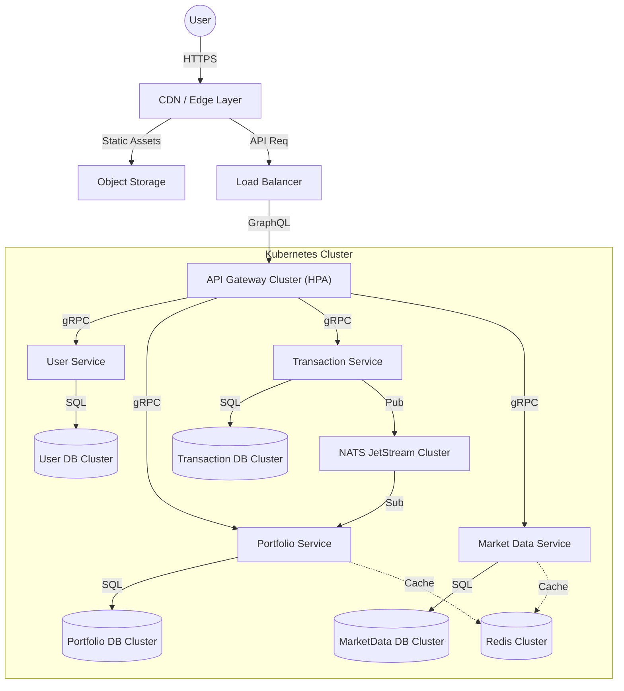

# Scalability Strategy: 500k Users

This document outlines the technical strategy for scaling the `portfolio-insights` application to support 500,000 users over the next 18 months.

## 1. Current Architecture (Current State)

The current system is a monolithic-style deployment of microservices sharing a single database instance, orchestrated via `docker-compose`.

*   **Frontend**: Single React SPA.
*   **Gateway**: Unified GraphQL Gateway (BFF).
*   **Services**: User, Portfolio, Transaction, Market Data (Go/gRPC).
*   **Data**: Shared PostgreSQL Instance (Single Master), Redis (Cache), MinIO (Blob).
*   **Messaging**: NATS (Event Bus).

> **Reference**: See `README.md` for the detailed context diagram.

---

## 2. Proposed Architecture (Target State)

To handle 500,000 users, we must eliminate single points of failure and contention. The target architecture moves to a **Distributed Cloud-Native** model.

### Key Architectural Changes
1.  **Database-per-Service**: Decouple the shared PostgreSQL instance into dedicated clusters for each service to isolate failures and scale throughput independently.
2.  **Horizontal Autoscaling**: Implementation of Kubernetes HPA (Horizontal Pod Autoscaler) for all stateless services (Gateway, Microservices).
3.  **Read/Write Splitting**: Implementation of Read Replicas for high-read services (Market Data, Portfolio).
4.  **Edge Caching**: Use of CDN (e.g., Cloudflare/CloudFront) for frontend assets and potentially cached GraphQL queries.

---

## 3. Technical Workstreams

### WS-1: Database Refactoring (Critical)
*   **Objective**: Decouple the shared `portfolio` database.
*   **Actions**:
    *   **Migration**: Split schemas into distinct physical databases (`user_db`, `portfolio_db`, `transaction_db`, `marketdata_db`).
    *   **Infrastructure**: Provision managed RDS/Aurora instances with Auto-Scaling Storage.
    *   **Optimization**: Implement `pgbouncer` for connection pooling at the pod level.

### WS-2: Caching Strategy
*   **Objective**: Reduce DB load by 90% for high-frequency data.
*   **Actions**:
    *   **Market Data**: Implement strict "Write-Through" or short TTL "Look-Aside" caching for asset prices in Redis Cluster.
    *   **Portfolio Snapshots**: Cache calculated portfolio summaries for active users with a 5-minute TTL.
    *   **CDN**: Offload React static bundles and images to an Edge CDN.

### WS-3: Asynchronous Processing
*   **Objective**: Ensure zero user-facing latency for write-heavy operations.
*   **Actions**:
    *   **Queueing**: Fully leverage NATS JetStream for durability.
    *   **Worker Pools**: Implement separate "Worker" deployments for background tasks (e.g., `portfolio-calculator-worker`) that consume from NATS, distinct from the gRPC serving layer.

### WS-4: Infrastructure & DevOps
*   **Objective**: Zero-downtime deployments and elastic scale.
*   **Actions**:
    *   **Orchestration**: Migrate from `podman-compose` to Kubernetes (EKS/GKE).
    *   **Autoscaling**: Configure HPA based on CPU/Memory and Custom Metrics (e.g., NATS Lag).
    *   **Observability**: Scale Prometheus/Grafana storage (e.g., Thanos/Cortex) to handle metric cardinality of 500k users.

---

## 4. Key Performance Indicators (KPIs) - 18 Month Horizon

| Category | Metric | Current (Est.) | Target (500k Users) |
| :--- | :--- | :--- | :--- |
| **Availability** | Uptime | 99.0% | **99.99%** (Four Nines) |
| **Performance** | API Latency (P95) | ~300ms | **< 100ms** |
| **Scalability** | Concurrent Users | ~50 | **5,000+** |
| **Throughput** | Transaction Processing | 10 TPS | **1,000 TPS** |
| **Data** | Portfolio Calculation Time | On-Demand | **< 50ms (Pre-computed)** |

## 5. Risk Assessment

*   **Data Migration Complexity**: Splitting the shared database is high-risk. **Mitigation**: Dual-write strategies and extensive dry-run migrations.
*   **Cost Explosion**: Cloud costs can spiral with 500k users. **Mitigation**: Aggressive caching and checking resource limits on Kubernetes namespaces.
