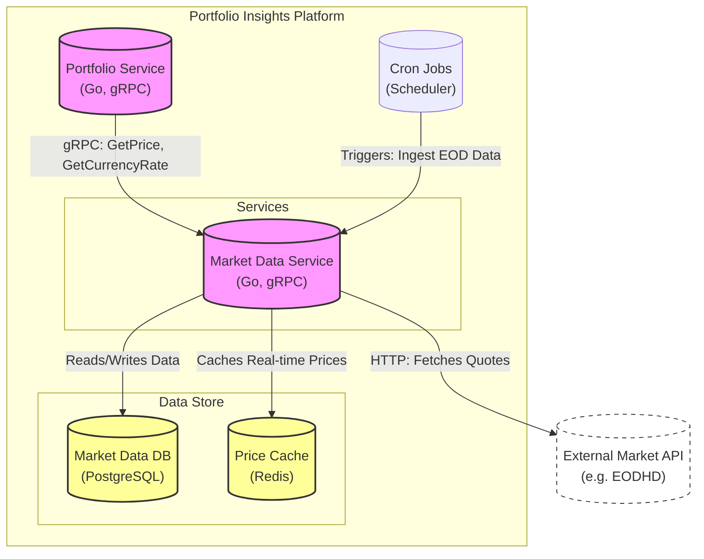
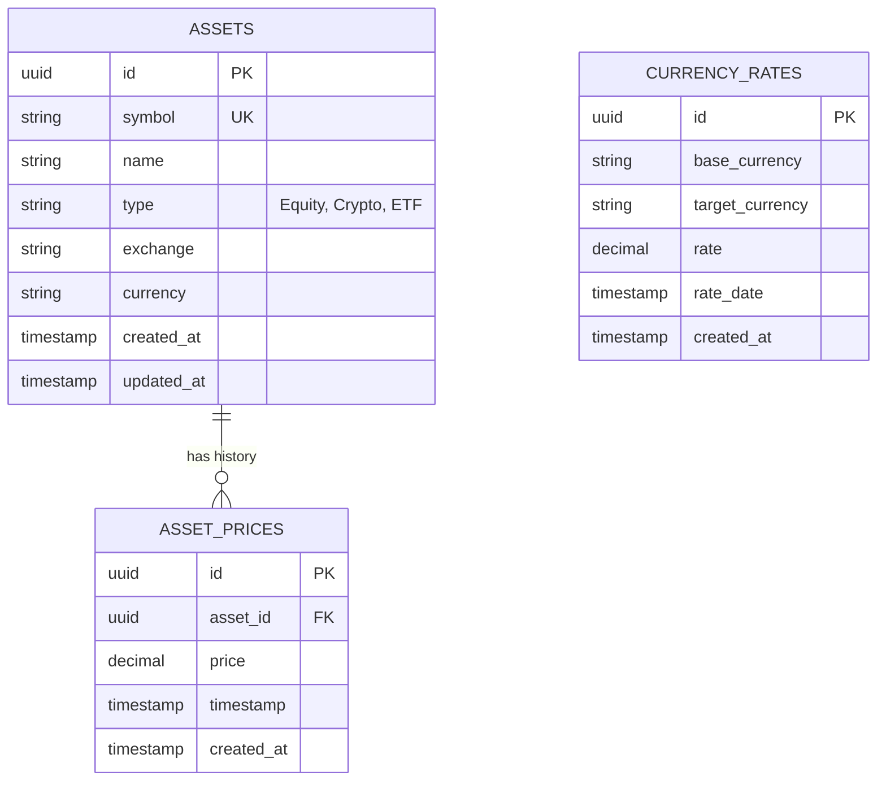

# Market Data Service - System Design

## Executive Summary

The **Market Data Service** is a foundational microservice responsible for ingesting, storing, and serving financial market data. It acts as the centralized source of truth for asset information, real-time prices, and historical currency exchange rates. Other services (like the Portfolio Service) rely on it for accurate valuation and currency conversion.

## Architecture Overview

The following C4 Container diagram shows the service interfaces and dependencies.

## Tech Stack

*   **Language**: Golang (1.24+)
*   **Communication**: gRPC (Internal APIs), HTTP (External Data Providers)
*   **Database**: PostgreSQL
*   **Caching**: Redis (Hot storage for latest prices)
*   **Migration**: Golang-Migrate
*   **Observability**: Prometheus, Slog

## Data Design

The service manages three core domains: Assets (metadata), Asset Prices (time-series), and Currency Rates (time-series).

## API Interface

The service exposes a gRPC interface.

| Method | Request | Response | Description |
|--------|---------|----------|-------------|
| `GetAsset` | `symbol` | `Asset` | Returns metadata for a specific asset (e.g., AAPL). |
| `SearchAssets` | `query` | `Asset[]` | Fuzzy search for assets by symbol or name. |
| `GetCurrentPrices` | `symbols[]` | `map[string]Decimal` | Returns the latest available price for a list of symbols. |
| `GetPriceOnDate` | `symbol`, `date` | `Decimal` | Returns the closing price on a specific historical date. |
| `GetCurrencyRateOnDate` | `from`, `to`, `date` | `Decimal` | Returns the FX rate for a specific date (Open/Close). |

## Key Workflows

### Injesting Assets, Asset_Prices, Currency_Rates

Data ingestion is primarily driven by scheduled jobs or on-demand backfills.

1.  **Trigger**: Cron job initiates `IngestEndOfDayData`.
2.  **Fetch Assets**:
    *   Iterates through the list of tracked symbols (config or DB).
    *   Calls external provider API to get daily metadata and confirms existence.
    *   Upserts to `ASSET` table.
3.  **Fetch Prices**:
    *   For each asset, fetches the daily candle (Open, High, Low, Close).
    *   Stores the `Close` price into `ASSET_PRICE` table.
    *   *Optimization*: If the price is "Today's", also updates Redis key `price:{symbol}`.
4.  **Fetch FX Rates**:
    *   Fetches base rates against USD (or base currency).
    *   Calculates cross-rates if necessary.
    *   Stores in `CURRENCY_RATE`.
5.  **Completion**: Logs success/failure stats.

## Scalability & Trade-offs

### Scalability strategies
*   **Read-Heavy Optimization**: 99% of traffic is read-heavy (Portfolios checking value). Redis is used to offload `GetCurrentPrices` calls from Postgres.
*   **Batch Interfaces**: APIs accept arrays (`symbols[]`) to reduce network RTT during portfolio calculation.

### Trade-offs
*   **Data Freshness**: To save API quota costs, data might be delayed (e.g., 15 min or EOD) rather than real-time streaming, which is acceptable for a "Portfolio Tracker" but not for a "Trading Bot".
*   **External Dependency**: The service is tightly coupled to the quality and availability of the external Data Provider. Circuit breakers are implemented to handle provider outages gracefully.
