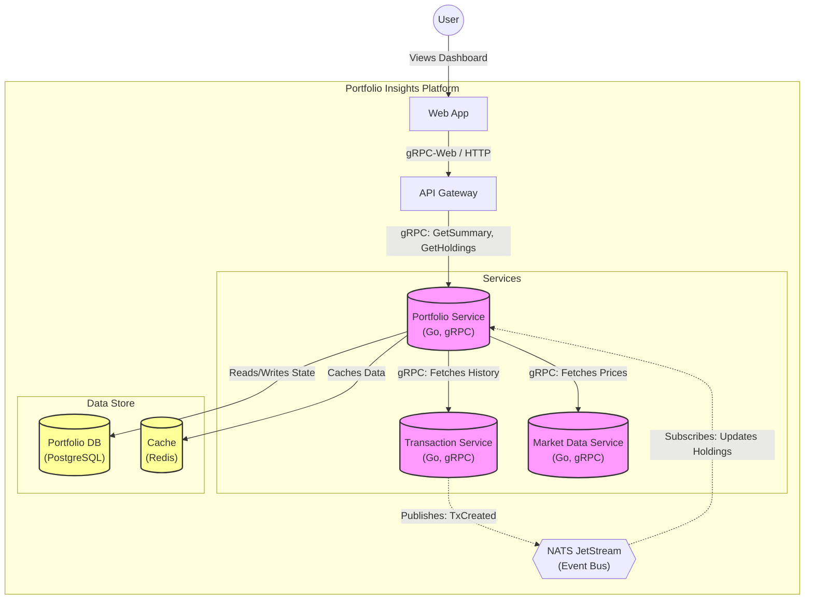
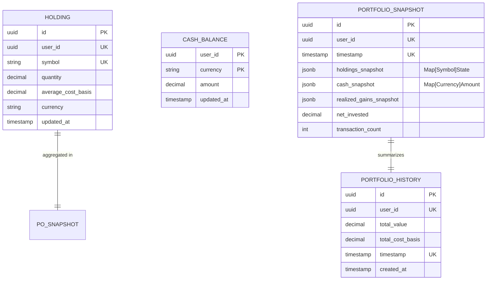

# Portfolio Service - System Design

## Executive Summary

The **Portfolio Service** is a core microservice responsible for tracking and calculating the financial performance of user portfolios. It acts as the "source of truth" for current holdings, historical performance, and real-time valuation. It aggregates data from the **Transaction Service** (historical mutations) and **Market Data Service** (pricing) to provide accurate, currency-aware portfolio insights.

## Architecture Overview

The following C4 Container diagram illustrates how the Portfolio Service interacts with the wider ecosystem.

## Tech Stack

*   **Language**: Golang (1.24+)
*   **Communication**: gRPC (Inter-service), NATS (Event-driven)
*   **Database**: PostgreSQL (Persistence)
*   **Caching**: Redis (Price & Historical Data Caching)
*   **Migration**: Golang-Migrate / SQL
*   **Observability**: Prometheus Metrics, Structured Logging (Slog)

## Data Design

The service maintains a "CQRS-lite" data model. The `holdings` table serves as a read-optimized view of the current state, while `portfolio_snapshots` stores historical checkpoints for performance calculations.

## API Interface

The service exposes a gRPC interface defined in `proto/portfolio/portfolio.proto`.

| Method | Request | Response | Description |
|--------|---------|----------|-------------|
| `GetHoldings` | `parent` (user resource) | `Holdings[]` | Returns all current holdings with real-time prices. |
| `GetPortfolioSummary` | `name` (resource), `start_date`, `end_date` | `PortfolioSummary` | Returns total value, gain/loss, and day change. |
| `GetPortfolioPerformance` | `name`, `period` | `DataPoints[]` | Returns historical chart data (e.g., "1Y", "ALL"). |
| `BackfillHistory` | `name`, `start_date` | `Status` | ADMIN: Triggers historical snapshot generation. |

## Key Workflows

### 1. Ingesting Transactions
This async workflow keeps the `holdings` table in sync with raw transactions without re-querying the entire history.

1.  **Listen**: Subscriber receives `transaction.created` event via NATS.
2.  **Fetch Context**: 
    *   Checks local `AssetCache` for asset metadata (e.g., Currency).
    *   If missing, calls `Market Data Service` to get asset details.
3.  **Update State**:
    *   **Equity**: Recalculates `Quantity` and `AverageCost` (Weighted Average) for the specific symbol. Upserts to `investments.holdings`.
    *   **Cash**: Updates `investments.cash_balances` by adding/subtracting the amount.
4.  **Invalidate Cache**:
    *   Marks future `portfolio_snapshots` as stale (since history has changed).
    *   Triggers background "Lazy Repair" if needed.

### 2. Calculating Real-time Portfolio Value
This workflow runs on-demand when a user views their dashboard (`GetPortfolioSummary`). It uses the **Incremental Aggregation** pattern.

1.  **Load Snapshot**: Fetches the *latest valid* `PortfolioSnapshot` (checkpoint) from PostgreSQL.
2.  **Fetch Delta**: Calls `Transaction Service` to get all transactions occurring *after* the snapshot timestamp.
3.  **Replay**:
    *   Initializes an in-memory `ReplayState` from the snapshot.
    *   **Hydrate**: Applies the "Delta" transactions sequentially to bring the state to "Now".
    *   *Optimization*: Caches historical FX rates during replay to minimize external calls.
4.  **Enrich**:
    *   Extracts all active symbols from the final state.
    *   Calls `Market Data Service` (`GetCurrentPrices`) to get real-time market data.
5.  **Calculate**:
    *   `MarketValue = Quantity * CurrentPrice * FXRate`
    *   `UnrealizedGain = MarketValue - CostBasis`
    *   `TotalValue = Sum(MarketValues) + Cash`
6.  **Return**: Responds with the fully calculated summary.

## Scalability & Trade-offs

### Scalability
*   **Incremental Aggregation**: Storing snapshots prevents "replaying the world" on every request. Complexity is O(Delta) rather than O(History).
*   **Caching**:
    *   **Price Cache**: Short TTL (1-5m) for real-time prices.
    *   **Historical Cache**: Long TTL for closed historical days (immutable).
*   **Async Ingestion**: Decouples write throughput (Transactions) from read latency (Holdings View).

### Trade-offs
*   **Consistency**: The `holdings` table is *eventually consistent* with the Transaction Service (sub-second lag usually).
*   **Complexity**: The "Replay" logic adds complexity compared to a simple SQL aggregation, but is necessary for accurate multi-currency cost basis handling.
*   **Dependency**: Heavy reliance on `Market Data Service`. If it goes down, portfolio valuation is impossible (though holdings count remains available).
