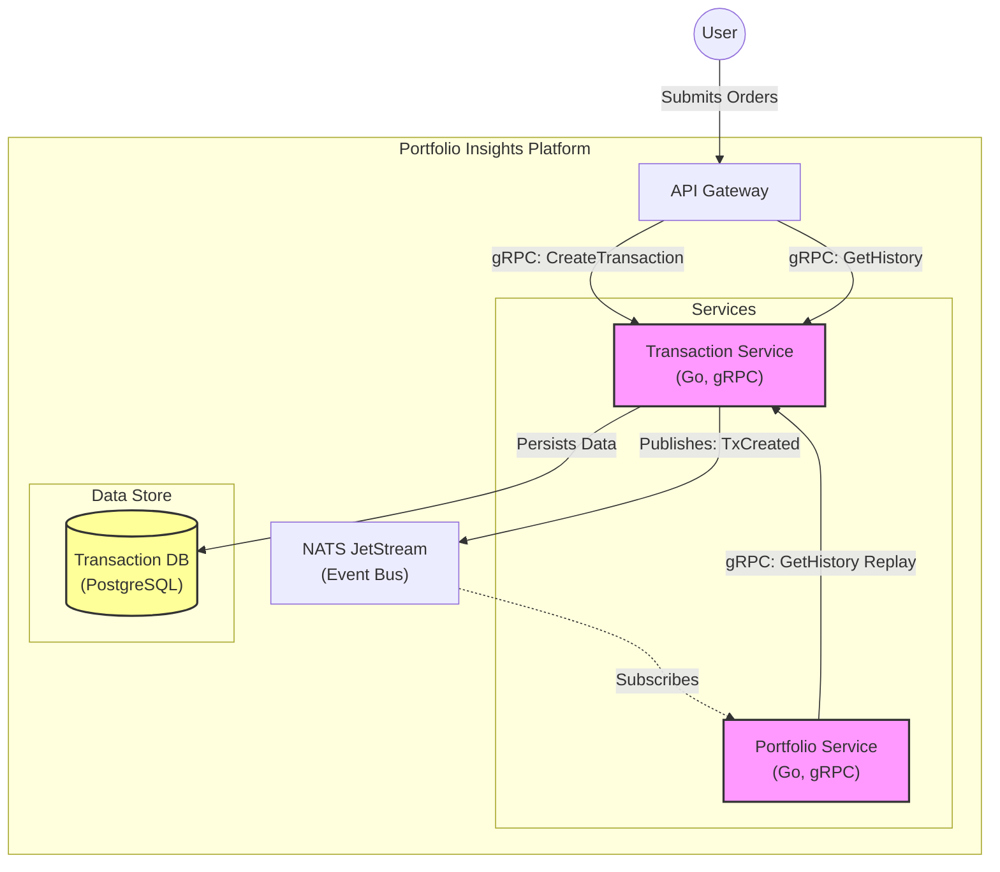
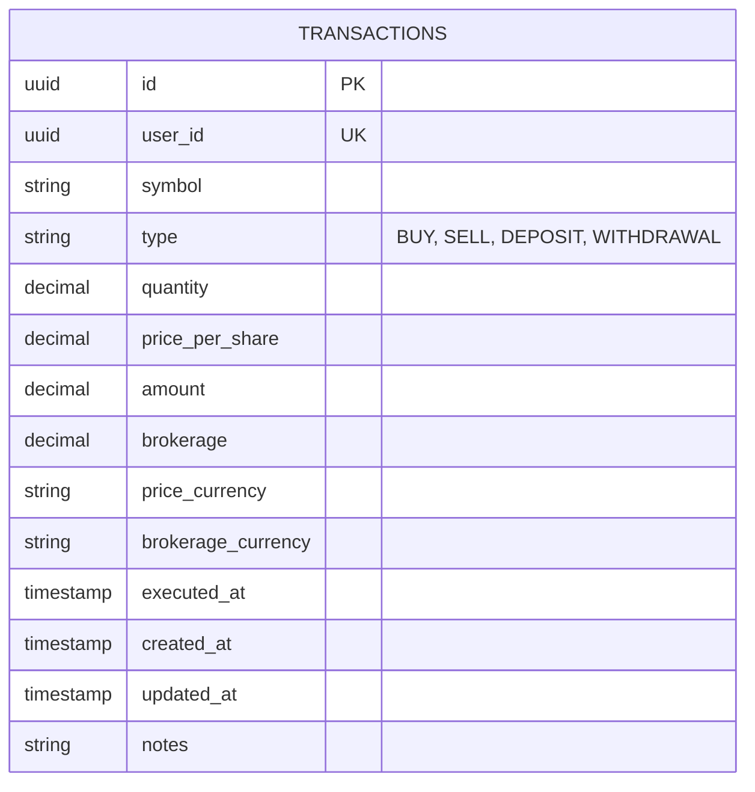

# Transaction Service - System Design

## Executive Summary

The **Transaction Service** is the reliable ledger for all user investment actions (buy, sell, deposit, withdraw). It handles the validation, persistence, and broadcasting of transaction events. It serves as the "Write Side" of the platform's investment data, feeding downstream services like Portfolio and Analytics via an event-driven architecture.

## Architecture Overview

The following C4 Container diagram illustrates the service's role in the platform.

## Tech Stack

*   **Language**: Golang (1.24+)
*   **Communication**: gRPC (Synchronous API), NATS JetStream (Asynchronous Events)
*   **Database**: PostgreSQL (ACID compliance is critical)
*   **Migration**: Golang-Migrate
*   **Observability**: Prometheus, Slog

## Data Design

The core entity is the `Transactions`. The data model is append-only for auditability (soft deletes or reversals preferred).

## API Interface

The service exposes a gRPC interface defined in `proto/transaction/transaction.proto`.

| Method | Request | Response | Description |
|--------|---------|----------|-------------|
| `CreateTransaction` | `TransactionInput` | `Transaction` | Records a new user transaction and publishes an event. |
| `GetTransaction` | `id` | `Transaction` | Retrieves a single transaction by ID. |
| `ListTransactions` | `user_id`, `filter` | `Transaction[]` | Returns a paginated list of transactions for a user. |
| `UpdateTransaction` | `id`, `changes` | `Transaction` | Modifies an existing transaction (publishes `TxUpdated`). |
| `DeleteTransaction` | `id` | `Status` | Soft-deletes a transaction (publishes `TxDeleted`). |
| `GetTransactionHistory` | `user_id`, `after_timestamp` | `Transaction[]` | Used by Portfolio Service to replay history since a snapshot. |

## Key Workflows

### Ingesting Transactions (Creation)

1.  **Request**: Gateway sends `CreateTransactionRequest` (User ID, Symbol, Qty, Price, Date).
2.  **Validation**: 
    *   Checks for logical errors (e.g., negative price, zero quantity).
    *   *Note*: Does not validate "Sufficient Funds" (Portfolio Service handles business logic/positions, this service is just a ledger).
3.  **Persistence**: 
    *   Opens a DB transaction.
    *   Inserts row into `transactions` table.
    *   Commits DB transaction.
4.  **Broadcast**:
    *   Publishes `transaction.created` event to NATS JetStream.
    *   Payload includes the full transaction state.
5.  **Response**: Returns the created ID to the caller.

### Bulk Ingestion (CSV)

To support migrating data from other tools, a bulk upload feature exists.

1.  **Upload**: User uploads CSV to Gateway.
2.  **Stream**: Gateway streams rows to Transaction Service via gRPC Client Streaming.
3.  **Process**: Service processes chunks, validating each row.
4.  **Batch Insert**: Uses PostgreSQL `COPY` or batched writes for performance.
5.  **Batch Publish**: Publishes events (throttled to avoid flooding NATS).

## Scalability & Trade-offs

### Scalability strategies
*   **Async Processing**: Downstream effects (Portfolio updates, Analytics) are decoupled via NATS. synchronous write latency is just "DB Insert + NATS Publish".
*   **Partitioning**: If volume grows, the `transactions` table can be partitioned by `user_id` or `date`.

### Trade-offs
*   **Validation Scope**: Unaware of "Position Validity" (e.g., selling more than you own). This complexity is pushed to the Portfolio Service to keep the Transaction Service simple and fast.
*   **Event Ordering**: Relies on NATS JetStream ordering guarantees to ensuring downstream consumers replay history correctly.
