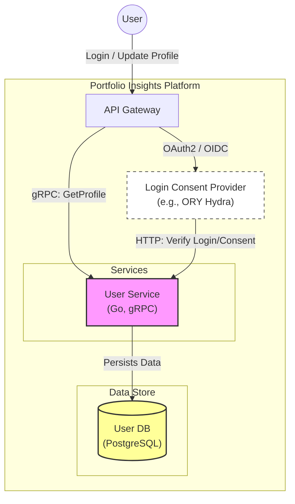
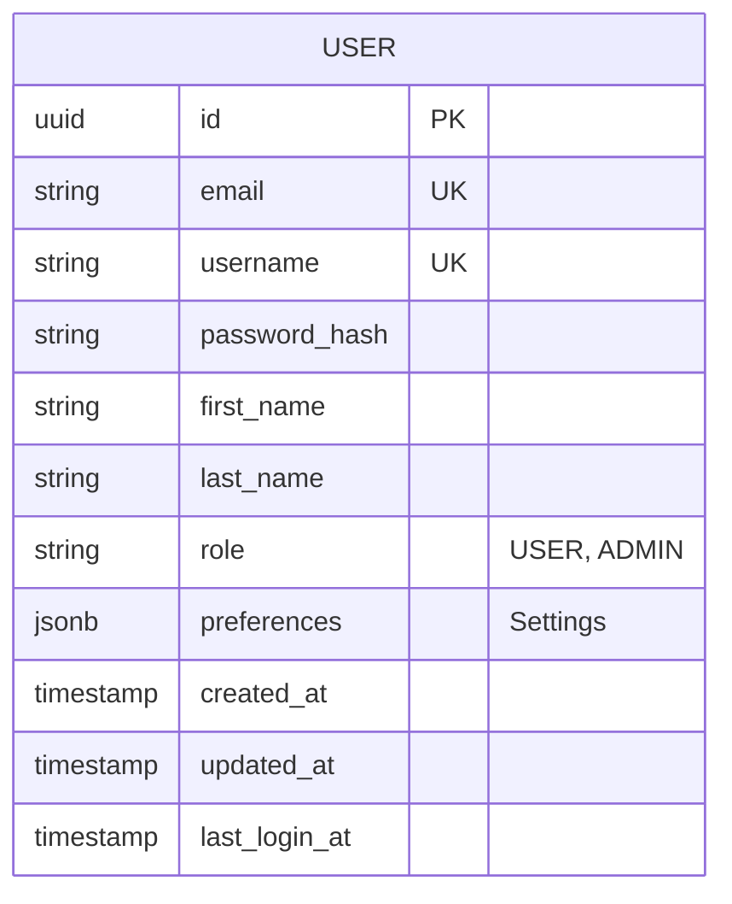

# User Service - System Design

## Executive Summary

The **User Service** is the central authority for user identity and profile management. It interfaces with an external **Login Consent Provider** (e.g., ORY Hydra) to handle authentication flows and manages user profile data (names, settings, preferences). It ensures that all other services have a consistent view of the user.

## Architecture Overview

The following C4 Container diagram shows the service's interactions.

## Tech Stack

*   **Language**: Golang (1.24+)
*   **Communication**: gRPC (Internal APIs), HTTP (Provider Callbacks)
*   **Database**: PostgreSQL
*   **Migration**: Golang-Migrate
*   **Observability**: Prometheus, Slog

## Data Design

The core entity is the `User`.

## API Interface

The service exposes a gRPC interface.

| Method | Request | Response | Description |
|--------|---------|----------|-------------|
| `GetUser` | `id` | `User` | Retrieves full user profile. |
| `UpdateUser` | `id`, `changes` | `User` | Updates editable fields (Name, Preferences). |
| `ValidateCredentials` | `email`, `password` | `Result` | Used internally by the Login flow to verify passwords. |
| `CreateUser` | `RegisterInput` | `User` | Registration logic (Hashing password, creating DB record). |

## Key Workflows

### Verifying User (Login Flow)

This workflow describes how the User Service acts as the "Identity Provider" backend for the Login Consent Provider.

1.  **Initiate**: User clicks "Login" in Web App, redirected to Login Consent Provider.
2.  **Redirect**: Provider redirects user to the `Login UI` (part of the platform frontend/gateway).
3.  **Submit**: User enters Email/Password.
4.  **Verify**:
    *   `Login UI` calls `User Service` (`ValidateCredentials`).
    *   Service checks DB (bcrypt comparison).
5.  **Consent**: 
    *   If valid, `Login UI` tells Provider to "Accept Login".
    *   Provider issues ID Token / Access Token.
6.  **Complete**: User is redirected back to the App with a valid session.

## Scalability & Trade-offs

### Scalability strategies
*   **Caching**: User profiles are high-read, low-write. Redis can be used to cache `GetUser` responses, invalidated on `UpdateUser`.
*   **Stateless Ops**: Authentication state is managed by the OIDC Provider (Tokens), not the User Service, allowing horizontal scaling.

### Trade-offs
*   **External Dependency**: Critical reliance on the Login Consent Provider. If Hydra/Auth0 is down, no one can log in.
*   **Complexity**: Implementing a custom Login UI to interface with Hydra is more complex than a monolithic Auth implementation but offers standard OAuth2/OIDC compliance.
